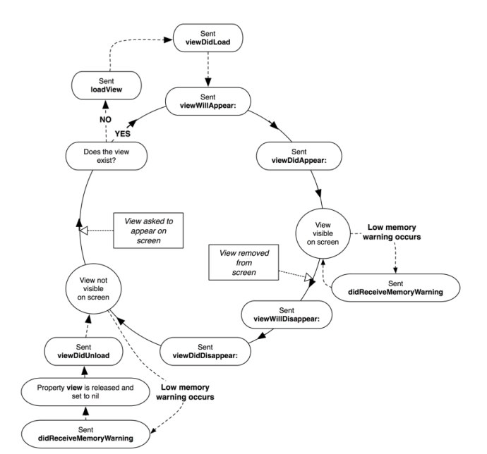
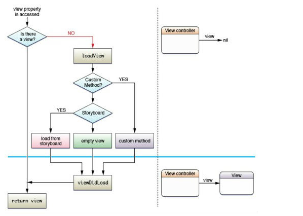
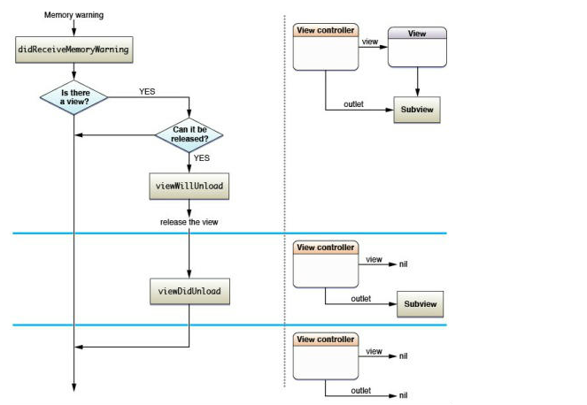

# ios ViewController
## 1.简介
        ViewController是iOS应用程序的重要部分，是管理应用中多个视图的工具，也是应用
    数据和视图之间的重要桥梁；
##2.分类
        按照结构，可以对iOS所有的ViewController分为两类：
        ① 主要用于展示内容的ViewController，这种ViewController主要用于为用户展示内
    容，并与用户交互，如UIViewController，UITableViewController；
        ② 用户控制和显示其他ViewController的ViewController，这种ViewController一般
    都是多个ViewController的容器。如UINavigationController，UITabBarController；
## 3.ViewController的使用
        UIViewController的创建方式有三种，stroyboard，xib，代码方式；
## 4.ViewController的生命周期
        ViewController的生命周期流程图如下：

        当一个视图控制器被创建，并在屏幕上显示的时候，执行顺序为：
        ① alloc：创建对象，分配空间；
        ② init：初始化对象，初始化数据；
        ③ loadView：从nib载入视图，通常这一步不需要去干涉，除非你没有使用xib文件
    创建视图；
        ④ viewDidLoad：载入完成，可以自定义数据以及动态创建其他控件；
        ⑤ viewWillAppear：视图将出现在屏幕之前，马上这个视图就会被展现在屏幕上；
        ⑥ viewDidAppear：视图已在屏幕上渲染完成；
        ⑦ viewWillDisappear：视图将被从屏幕上移除之前执行
        ⑧ viewDidDisappear：视图已经被从屏幕上移除，用户看不到这个视图了；
        ⑨ dealloc：视图被销毁，此处需要对创建的对象进行释放；
        ps：viewDidUnload：在发生内存警告时，如果本视图不是当前屏幕上正在显示的视
    图的话，viewDidUnload将会被执行，本视图的所有子视图将会被销毁，以释放内存，此时
    开发者需要手动对创建的对象释放内存；因为当这个视图再次显示到屏幕上时，viewDidLoad
    会被再次调用，一遍再次构造视图；
## 5.view的加载过程
        view的加载流程如下：

        viewController对view的加载过程：
        ① 判断子类是否重写了loadView，如果有直接调用，之后调用viewDidLoad完成对
    view的加载；
        ② 如果没有重写loadView，则先看有没有stroyboard，如果有，就按照stroyboard
    的名称去加载里面的view；
        ③ 如果没有stroyboard，则加载xib里面的view，此时的顺序是：
            A.如果指定了xib的名称，即外部调用initWithNibName方法，则加载里面响应
        的view；
            B.如果没有执行名称，则加载与视图名称前缀相同的xib里的视图，如视图控制
        器的名称是MyViewController，则优先加载名字为MyView.xib的文件；
            C.其次，如果没有MyView.xib的文件，则加载与控制器同名的xib里的视图，即
        加载MyViewController.xib文件；
            D.如果都没有，则加载个空白的view。
        
        ps：① loadView只被调用一次，即第一次打开程序的时候发现没有view，则先去找
        loadView，如果有的话就创建，如果没有则执行其他步骤。加载完成后，第二次就
        不会调用loadView了。
            ② 控制器的view是延迟加载的，即用到的时候才加载，也就是调用viewDidLoad
        方法。
            ③ 创建xib的时候，要注意xib文件的名字。
## 6.view的卸载过程
        view的卸载流程图如下

        ① 系统发出警告或者ViewController本身调用导致didRecieveMemoryWarning被调用
        ② 调用viewWillUnload之后释放view；
        ③ 调用viewDidUnload；
## 7.视图切换
        ios开发中常见的视图切换有三种：
        ① UITabBarController：以平行的方式管理视图，各个视图之间往往关系并不大，每个
    加入到UITabBarController的视图都会进行初始化，即使当前不显示在界面上，相对比较占
    用内存；
        ② UINavigationController：以栈的形式管理视图，各个视图的切换就是压榨和出栈操
    作，出栈后的视图会立即销毁；
        ③ UIModalController：以模态窗口的形式管理视图，当前视图关闭其他视图上的内容
    无法操作。
